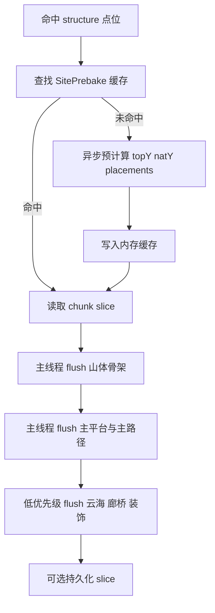

# 宗门生成性能优化深度分析报告

## 执行摘要

基于你提供的“宗门 worldgen 逻辑详解”，当前实现已经具备几个**非常正确且不应轻易破坏**的基础设计：它是典型的 Minecraft/NeoForge 结构生成路径，采用数据驱动结构注册与 `structure_set` 控制稀有度；生成时不 `force-load` 区块；通过 `Clip + WorldGenSink` 把每次回调的写世界范围限制在当前相交区块；并且用稳定的 `siteSeed`、绝对世界 Y 与 `slotRandom` 保障跨区块拼接一致性与结果确定性。换句话说，这个实现**不是“架构方向错了”**，而是已经有了正确的世界生成骨架，但在“单次相交区块回调里做了多少重复计算与块写入”这件事上，仍然很可能过重。fileciteturn0file0L12-L42 fileciteturn0file0L65-L76 fileciteturn0file0L178-L217 fileciteturn0file0L233-L243

从你给出的实现细节看，**最该优先处理的不是“换噪声算法”或“上八叉树”**，而是三件事。第一，`postProcess` 在每个相交区块都会重复重建 `plan` 与 `mountain`，而真正重的步骤是后续 `writeMountain`、`carveTerraces`、`placeTemplate` 等写世界逻辑；第二，山体烘焙在每列上都要做 `height/naturalAt` 查询与竖向填充/清空，这往往是区块卡顿的核心来源；第三，当前 piece 的包围盒覆盖整座山体、skirt 和高度，因此一个宗门会触发很多相交区块回调，导致“每个区块都要重新走一遍固定四阶段”。这些都意味着首要优化方向应该是：**把纯计算结果按站点预烘焙并缓存、把块写入改成切片化与批量化、把重步骤按优先级延后或异步预计算**。fileciteturn0file0L124-L146 fileciteturn0file0L154-L176 fileciteturn0file0L68-L76

如果只能给一句最可执行的建议，那就是：**先不要动生成“长什么样”，先把“怎么写出来”重构成“站点预计算缓存 + 区块切片 flush”的两阶段管线**。在经验上，这类改动往往比单纯微调数学函数更能显著压低 P95/P99 区块生成延迟；而且它与现有确定性设计天然兼容，适合做成可灰度、可回退的演进。对 Java 侧定位热点，建议用 JFR 做低开销持续采样、用 async-profiler 验证 CPU/分配热点、再用 JMH 对纯函数做微基准；OpenJDK 将 JFR 设计为低开销事件采集框架，async-profiler 明确强调低开销且避免 safepoint bias，JMH 则是 OpenJDK 官方 JVM 基准 harness。citeturn4view0turn5view1turn21view0

## 现状诊断与瓶颈判断

### 从已知实现看，当前设计的优点在哪里

你提供的实现说明，这个 mod 的宗门生成不是“随机到哪写到哪”，而是标准的结构生成链路：`StructureType` 与 `StructurePieceType` 通过 NeoForge 注册，真正的“在哪生成、生成阶段、稀有度、允许群系”交给数据包中的 `structure` / `structure_set` / biome tag 决定；并且结构稀疏分布，平原低地直接被排除。这个基础是正确的，因为它把“触发条件”与“生成实现”分离了，便于后续单独优化生成逻辑而不改动世界规则。fileciteturn0file0L4-L42

更关键的是，当前实现已经解决了大型结构最容易翻车的几个问题：它不用 `force-load`；在每个相交区块的 `postProcess` 里重建纯函数 `plan` 与 `mountain`，确保不同区块看到一致几何；同时 `WorldGenSink` 通过当前区块的包围盒把越界写入直接丢弃，再配合 `clipLo/clipHi` 收紧循环边界，把每次回调的工作限定在当前 chunk 的列范围内。这说明你现在的代码**已经具有“无缝拼接”和“单区块工作有界”的意识**，这一点非常好，后续优化要尽量在这套约束下前进，而不是回退到“整座结构一次性写完”。fileciteturn0file0L124-L136 fileciteturn0file0L178-L201 fileciteturn0file0L233-L243

### 真正值得怀疑的热点在哪里

从文件内容看，`mountain` 的噪声并不是复杂的 Perlin/Simplex/FBM 级别采样，而是固定乘数旋转哈希再取模到 `[-amp, amp]` 的整数噪声，用来给山体外围羽化增加扰动，而且还要和 Python 端保持 parity。也就是说，**在你这个具体实现里，“噪声函数太慢”并不太像头号嫌疑人**；如果一开始就花大量精力替换噪声库，极有可能收益不高。fileciteturn0file0L121-L123

更像头号瓶颈的，是 `writeMountain` 与后续 compound realize 阶段。`writeMountain` 对 core ± margin 范围的每一列都要计算 `top` 和 `nat`，然后从 `min(nat, top)` 填石头到 `top`，再从 `top+1` 清空气到 `nat`；这类“按列纵向填实/清空”的逻辑会直接转化为大量 block set 调用。随后 `carveTerraces` 还要向下填到自然地表、向上清出净空，`placeAxisStairs`、`placeRetainingFaces`、`placeCliffBack`、`realizeSlots`、`placeCoveredGalleries`、`realizeFeature` 会进一步叠加循环和模板放置成本。换句话说，**真正重的是块写入次数、竖向跨度、模板加载与重复 height/natural 查询**。fileciteturn0file0L138-L163

另一个高概率热点，是**重复计算相同站点的自然高度与派生高度**。你当前 `buildMountain` 依赖 `chunkGenerator.getBaseHeight(...)` 这个回调，目的是保证不同区块生成顺序下仍然确定；但如果相邻 chunk 的多次 `postProcess` 都对同一站点的同一批局部列反复调用 `baseHeight` / `height()` / `naturalAt()`，那么 CPU 会把许多时间浪费在重复查询而不是真正有差异的工作上。对于这种“同一站点、跨多个 chunk 重复访问同一局部列”的模式，**站点级高度表缓存**几乎一定是高收益项。fileciteturn0file0L84-L88 fileciteturn0file0L124-L146

还有一点很重要：你现在的 piece 包围盒必须覆盖整个宗门足迹、blend skirt 和山顶高度，这本来是为了让每个相交区块都能触发 `postProcess`。这没错，但它也意味着一个宗门站点会把很多区块卷进来。于是，哪怕每个区块的循环已经被 clip 限制，“固定四阶段 + 模板逻辑 + 判断分支”仍然会在很多 chunk 上一遍遍发生。**因此第二阶段优化不只是“让每个 chunk 更快”，还应当考虑“让无关 chunk 尽量少参与某些阶段”**。fileciteturn0file0L68-L76 fileciteturn0file0L124-L136

### 这意味着什么样的优先级排序

基于以上判断，优先级上我建议这样排：

第一优先级不是“改生成效果”，而是**把瓶颈测出来**。OpenJDK 的 JFR 专门为低开销问题分析而设计，目标之一就是在启用时仍把额外开销控制得很低；JFR 还支持自定义事件，适合给 `writeMountain`、`placeCloudSea`、`realizeCompound` 分阶段打点。与此同时，async-profiler 适合抓真实 CPU 热点和分配热点，因为它是低开销采样型 profiler，并明确强调不受 safepoint bias 影响。citeturn4view0turn5view1

第二优先级是**站点级预计算和缓存**，第三优先级是**异步纯计算**，第四优先级才是更深的 piece 拆分、持久化切片缓存、LOD/降级。原因很简单：你当前实现已经有了确保确定性的好骨架，所以最划算的做法是把“重复纯计算”与“按 chunk flush”分离出来，而不是推翻重写。fileciteturn0file0L124-L136 fileciteturn0file0L203-L240

## 候选优化方案总表

下表中的“预期性能提升”均为**经验估算区间**，用于排序，不是承诺值；真实收益必须以你自己的基准复核。

| 方案名称 | 核心思想 | 预期性能提升 | 实现难度 | 主要风险 | 适用场景 | 优先级 | 估算工时 |
|---|---|---:|---|---|---|---|---:|
| 分阶段剖析与埋点 | 用 JFR + async-profiler + 自定义 phase 计时抓出 `writeMountain` / `templates` / allocation 热点 | 不直接提速，但能避免误判 | 低 | 埋点粒度不对导致误导 | 所有场景 | 最高 | 0.5–1.5 人日 |
| 站点级高度表缓存 | 以 `siteSeed + 配置版本` 为 key 预计算 `topY[]/natY[]/flags[]`，chunk 只查表 | 20%–45% | 中 | 内存上涨、失效策略不当 | 山体/台地/绝壁类结构 | 最高 | 2–4 人日 |
| 模板与放置上下文缓存 | 缓存 NBT 模板、旋转/镜像变换结果、slot 到 chunk 的映射 | 10%–30% | 中 | 热更新资源包后失效 | 模板建筑多、slot 多 | 最高 | 2–4 人日 |
| 切片化 flush | 先把一个站点预烘焙成 `ChunkSlice`，`postProcess` 只 flush 当前 slice | 25%–55% | 中高 | 需要重构数据流 | 结构跨多 chunk、重复判断多 | 最高 | 4–7 人日 |
| 异步纯计算 | `plan/mountain/placements` 在专用线程池预计算，世界写入仍在主线程/安全回调执行 | 15%–40% 峰值卡顿改善更大 | 中高 | 线程安全、回退逻辑复杂 | CPU 富余、主线程卡顿明显 | 高 | 4–8 人日 |
| piece 拆分 | 把单一大 piece 拆为山体、台地、云海、模板等子 piece，减少无关区块触发 | 15%–35% | 高 | seam、顺序、一致性验证成本高 | 大包围盒、多相交区块 | 高 | 5–8 人日 |
| 渐进式生成优先级 | 先生成可行走山体/主路径，再补云海、廊、装饰 | 10%–30% 体感提升很大 | 中 | 近看短时“未完成”观感 | 玩家接近时卡顿 | 中高 | 3–6 人日 |
| 持久化切片缓存 | 将预烘焙 slice 落盘，热站点复用；热路径用 LZ4，冷路径可考虑 Zstd | 二次访问 30%–70% | 中高 | 版本兼容、磁盘占用 | 常访问区域、服务器 | 中 | 3–7 人日 |
| LOD / 细节降级 | 远距离只做地形骨架，不做细部或模板内部 | 体感改善明显 | 中高 | 与原设计目标不一致 | 远距离接近、客户端首见 | 中 | 4–8 人日 |
| 更深层空间分区 | 用 uniform grid / spatial hash 管 slots/features；暂不优先上八叉树 | 初期有限，后期可扩展 | 中 | 过度设计 | 站点内容数量变多时 | 中低 | 2–5 人日 |

这个排序背后的依据是：JFR 支持低开销事件采集与自定义事件；async-profiler 是低开销采样 profiler；Caffeine 采用 Window TinyLFU，强调高 hit rate 与低内存占用，很适合做“活跃站点 LRU”；而你当前代码又天然适合用 `siteSeed` 做缓存 key，因为站点生成本来就是确定性的。citeturn4view0turn5view1turn5view3 fileciteturn0file0L61-L67

## 重点优化方案与伪代码

### 先把生成改成“站点预计算 + 区块切片 flush”

这是我认为最值得你立即落地的主方案。核心思想是：保留现有 `siteSeed`、`plan`、`mountain`、`slotRandom`、绝对 Y 设计不变，只把它们从“每个 chunk 回调里临时算、临时写”改成“第一次访问站点时预烘焙成站点缓存，再由各 chunk 回调按切片读取并 flush”。这样能在不改世界观感的前提下，显著消除重复 `height/natural` 查询、重复模板解析、重复 chunk 归属判断。你当前文件已经明确说明，同一站点的结果应该由世界种子与坐标唯一决定，而且跨 chunk 一致性依赖稳定种子与绝对 Y，这非常适合做不可变预烘焙对象。fileciteturn0file0L61-L67 fileciteturn0file0L203-L217 fileciteturn0file0L233-L240

建议的站点缓存结构，大致可以是：

```java
record SiteKey(long siteSeed, int configHash, int algoVersion) {}

final class SitePrebake {
    final SectPlan plan;                 // 不可变
    final short[] topY;                  // [localX + width * localZ]
    final short[] natY;
    final byte[] flags;                  // 平台/裙边/绝壁/孤峰等
    final Int2ObjectMap<List<Placement>> placementsByChunk; // 每个 chunk 的模板/台阶/廊等放置项
    final Int2ObjectMap<List<ColumnSpan>> mountainSpansByChunk; // 每个 chunk 的列式填充/清空区间
}
```

比起直接在 `height(x,z)` 上继续做函数级优化，我更建议你**直接预烘焙出列式 span**。因为你当前真正重的是按列填石头、清空气，而不是做一个简单整数哈希噪声。把 `topY/natY` 预先算好，再把每列转成 `solidFrom..solidTo` 与 `airFrom..airTo`，chunk flush 时只做直线型循环，通常比每次都重新分支判断更稳定。fileciteturn0file0L138-L146 fileciteturn0file0L121-L123

伪代码如下：

```java
SitePrebake prebakeSite(SiteKey key, BlockPos base, ChunkGenerator gen, RandomState rs) {
    SectPlan plan = SectGenerator.plan(key.siteSeed(), base);
    int width = SITE_WIDTH + 2 * MOUNTAIN_MARGIN;
    int depth = SITE_DEPTH + 2 * MOUNTAIN_MARGIN;

    short[] topY = new short[width * depth];
    short[] natY = new short[width * depth];
    byte[] flags = new byte[width * depth];

    for (int lz = 0; lz < depth; lz++) {
        for (int lx = 0; lx < width; lx++) {
            int worldX = base.getX() - MOUNTAIN_MARGIN + lx;
            int worldZ = base.getZ() - MOUNTAIN_MARGIN + lz;

            int nat = gen.getBaseHeight(worldX, worldZ, WORLD_SURFACE_WG, level, rs);
            int top = fastDerivedTop(plan, nat, lx, lz); // 等价于现有 height()，但只算一次

            int idx = lx + lz * width;
            topY[idx] = (short) top;
            natY[idx] = (short) nat;
            flags[idx] = classify(plan, lx, lz);
        }
    }

    var placementsByChunk = partitionPlacementsByChunk(plan, key.siteSeed(), base);
    var mountainSpansByChunk = buildMountainSpans(topY, natY, width, depth, base);

    return new SitePrebake(plan, topY, natY, flags, placementsByChunk, mountainSpansByChunk);
}
```

对于当前实现，我会把“空间分区”控制在**uniform grid 或 spatial hash** 级别，而不是上来就引入四叉树/八叉树。理由并不抽象：你的 `plan` 本身只有五级 terrace，`feature` 也是少量确定变体；`nearestTerraceHeight` 这类逻辑在今天的规模下是小常数。也就是说，**当前不是典型的“对象数目爆炸，需要树形索引”场景**。如果后续一个宗门要容纳上百 template、上千 feature，再考虑更复杂的空间索引更划算。fileciteturn0file0L167-L176 fileciteturn0file0L108-L119

### 把单一大 piece 改成“逻辑分片”，而不是“每个 chunk 都跑完整流程”

当前 `postProcess` 的固定四步是：重建 `plan`、重建 `mountain`、建 `WorldGenSink`、然后依次调用 `writeMountain`、`placeCloudSea`、`realizeCompound`。这对一致性很好，但对性能不总是最优，因为即便某些 chunk 最终没有模板放置，也会先走到不少共性判断。fileciteturn0file0L124-L136

更合适的做法，是逻辑上把一个宗门拆成几个“可独立判定是否与当前 chunk 相关”的子阶段，最小可行拆法可以是：

- 山体骨架片
- 台地/台阶片
- 模板建筑片
- 云海与装饰片

这样每个相交 chunk 只会拿到与自己有关的 slice，不再无条件遍历所有阶段。注意，我说的是**逻辑分片**，不一定非要立刻变成 Minecraft 层面的多个 physical `StructurePiece`；你也可以先在 `SitePrebake` 里做 phase-specific `placementsByChunk`，验证收益后再决定是否真的拆 piece。这样风险更低。fileciteturn0file0L68-L76 fileciteturn0file0L154-L163

### 异步只做纯计算，世界写入仍留在安全线程

Java 并发层面，如果你要做异步，建议**明确区分“纯计算”和“世界改写”**。对于纯计算部分，可以用专用 `ForkJoinPool` 或自定义 `Executor` 跑站点预烘焙。Oracle 对 `ForkJoinPool` 的定义就是“使用 work-stealing 的 ExecutorService”，很适合大量小任务；同时它也提供 `getStealCount()`、`getQueuedSubmissionCount()` 等状态指标，方便你在线上调优。citeturn22view0

但不要偷懒直接把大量 worldgen 重活默认丢给 `CompletableFuture.supplyAsync/runAsync`，因为 Java 文档明确写着，这两个默认会跑在 `ForkJoinPool.commonPool()` 上。对 mod 环境来说，共享 common pool 往往意味着跟其他异步任务互相争夺线程，难以做限流与回退。更稳妥的做法是显式提供专用 executor，并给它设置有上限的并行度、任务队列与取消策略。citeturn23view0turn22view0

一个实用模式如下：

```java
private static final ForkJoinPool WORLDGEN_POOL =
    new ForkJoinPool(Math.max(1, Runtime.getRuntime().availableProcessors() - 2));

CompletableFuture<SitePrebake> future = CompletableFuture
    .supplyAsync(() -> cache.get(key, k -> prebakeSite(k, base, gen, rs)), WORLDGEN_POOL);

void postProcessChunk(ChunkPos chunkPos, BoundingBox box) {
    SitePrebake prebake = future.getNow(null);
    if (prebake == null) {
        // 回退策略：同步轻量预计算，或只做山体骨架，装饰下次补
        prebake = fallbackSyncPrebake(key, base, gen, rs);
    }
    flushChunkSlice(prebake, chunkPos, box, level); // 仍在安全线程执行 setBlock
}
```

为什么要这样做？因为 Oracle 的 `ForkJoinPool` 文档也提醒：当任务里存在被阻塞的 I/O 或未受管理的同步时，线程池不保证完美自动调节活跃线程数。所以**压缩、磁盘读写、网络同步**最好放到另外的 I/O executor，不要与 CPU 型站点预计算混在同一个 pool 里。citeturn22view0

### 用渐进式生成降低“接近时卡顿”的体感

你给的文件明确把目标之一写成“approaching does not stall”。如果用户的主诉是“生成逻辑很卡”，那从体感优化角度，**P99 峰值延迟**比平均耗时更重要。与其让玩家靠近结构时一次性看到完整云海、廊桥、模板内部细节，不如拆成优先级队列：先保证山体轮廓、主平台、主路径和碰撞正确；再补挡土墙、云海、廊桥和装饰。fileciteturn0file0L178-L180 fileciteturn0file0L149-L163

这个思路与大型世界引擎的实践是一致的。Unreal 的 World Partition 把大地图切成 grid cells，并基于 streaming source 的距离来决定加载/卸载；Distant Horizons 则用 LOD 把普通渲染距离外的 chunk 简化后渲染，用更大的可视距离换取性能。这两者都说明：**远处先用粗表达，近处再补细节，是成熟的大世界系统常见路线**。citeturn7view2turn24view0

一个适合你的目标流程可以这样表达：



## 缓存、I/O 与引擎实践

### 缓存与内存管理

对于站点缓存，推荐优先使用**有限容量、统计可观测、按权重淘汰**的缓存，而不是无界 `HashMap`。Caffeine 官方文档把 Window TinyLFU 作为默认策略，原因是它兼顾高 hit rate 与低内存占用，并且对 recency/frequency 混合负载表现很好；这很适合“玩家在结构附近来回移动、同一站点会被短时间反复访问”的世界生成场景。citeturn5view2turn5view3

在 key 设计上，不要只用 `siteSeed`，还应拼上**结构配置版本、资源包/模板 hash、算法版本号**。因为你当前实现中，站点结果不仅受世界种子与坐标影响，也受数据包、模板和生成算法实现影响；只用 `siteSeed` 会导致升级后脏缓存误命中。fileciteturn0file0L12-L42 fileciteturn0file0L61-L67

缓存对象建议至少分三层：

| 层级 | 内容 | 生命周期 | 建议策略 |
|---|---|---|---|
| 热缓存 | `SitePrebake`、`topY/natY`、`placementsByChunk` | 数秒到数分钟 | Caffeine + `maximumWeight` |
| 温缓存 | 已解析 NBT 模板、旋转/镜像结果 | 整个会话 | 小容量常驻 |
| 冷缓存 | 持久化 `ChunkSlice` 或站点预烘焙文件 | 多次启动复用 | 版本化落盘 |

内存方面，要特别警惕**“为了省 CPU，结果把 GC 打爆”**。因此你应该尽量使用原始数组、紧凑结构和对象池，而不是为每一列、每个 placement 创建短命小对象。如果站点大小固定，`short[] topY`、`short[] natY`、`byte[] flags`、`Int2ObjectMap<List<...>>` 这类结构可显著减少分配抖动，JFR 也能帮助你验证分配热点与 GC 压力。JFR 的事件模型支持方法、分配、GC 等信息采集，适合你把“算得慢”和“分配太多”区分开。citeturn4view0

### I/O 与序列化

若你打算把 `ChunkSlice` 或站点预烘焙结果持久化，建议把策略分成两层：

对**热路径**，优先考虑 LZ4。LZ4 Java 官方说明它的 fast 模式内存占用低、压缩很快、解压也很快；这很适合“进附近区块时快速读回 slice”这种延迟敏感场景。citeturn19view0

对**冷路径**，如果你更在意磁盘占用或网络传输体积，可以考虑 Zstandard。官方文档明确写到，Zstandard 是快速压缩算法，提供更高压缩比，并且可以在速度和压缩率之间连续调节；对于小数据还有 dictionary compression 模式。对于世界生成这类大量“结构相似的小块记录”，词典压缩通常很有价值。citeturn20view0turn20view1turn20view2

存储格式上，我不建议直接把 Java 对象序列化；更稳妥的是自定义二进制格式，例如：

```text
magic | version | configHash | siteSeed | bbox | flags
chunkCount
  chunkPos | mountainSpanCount | placementCount | compressedPayloadLen | payload
checksum
```

若你希望做更成熟的持久化缓存，也可以参考 Distant Horizons 服务器/单机的 LOD 数据落到 `DistantHorizons.sqlite` 的做法。它至少说明一件事：**大世界或远景数据完全可以与原始 chunk 数据分离，持久化到独立数据文件中**，这样有利于版本迁移和单独清理缓存。citeturn24view1

### Minecraft、Unity、Unreal 的落地要点

如果实际环境就是你文件所显示的 **Minecraft/NeoForge**，那么我的建议很明确：保留你当前的 `postProcess + clip` 基本框架，**异步只做纯函数预计算，世界写入继续留在安全回调/主线程**。你现在的设计已经非常重视不 `force-load`、跨 chunk 一致性与绝对 Y，这些都必须保留；最适合改的，是“预计算什么”和“每个 chunk 实际 flush 什么”。fileciteturn0file0L67-L67 fileciteturn0file0L178-L217 fileciteturn0file0L229-L230

如果未来同类逻辑要迁移到 **Unity**，官方建议的路线几乎就是“把 CPU 绑定工作拆成 Job，并尽量用 Burst 编译”。Unity 文档说明 Job System 会把任务分发到与 CPU 核数匹配的 worker threads，并采用 work stealing；Burst 则把兼容的 C# 代码编译成高度优化的原生 CPU 代码，而且官方明确指出，把项目重构为 Burst 编译的 jobs 能显著改善 CPU-bound 代码性能。citeturn5view4turn9view0

如果是 **Unreal**，则更适合按 DAG 来拆 worldgen 子任务。Epic 的 Tasks System 文档把它定义为异步执行 gameplay code 的任务系统，支持任务前置依赖、嵌套任务与 pipes；同时官方明确提醒“等待应尽量避免，因为会限制可扩展性”，并指出旧式 busy-waiting 容易造成死锁、卡顿和长时间无响应。搭配 World Partition 的 grid cell 与 distance-based streaming，Unreal 的典型优化思路就是：**先把世界切成流式格子，再用任务图而不是阻塞等待来推进生成**。citeturn6view1turn7view0turn7view2

## 参考项目与架构借鉴

下表选了 6 个更贴近“生成/大世界/性能”主题的 mod 或项目。它们不一定都与你的宗门结构同类，但都能给“如何降低生成卡顿”提供具体借鉴。

| 项目 | 原始来源与定位 | 关键技术点 | 你可借鉴的部分 | 更适用的场景 |
|---|---|---|---|---|
| TerraForged | 官方 GitHub；Minecraft world-gen mod，仓库同时有 Fabric、Forge 和生成资源目录。citeturn14view0 | 数据与代码分层、跨 loader 组织 | 把站点逻辑与资源/数据层解耦，方便回归测试与灰度开关 | 地形/结构生成都较重的项目 |
| OpenTerrainGenerator | 官方 GitHub；面向 Bukkit/Spigot/Forge 的 Terrain Generator。citeturn14view1 | 强调“生成器”本身可独立演进 | 把你的“宗门站点预烘焙器”封装成独立生成模块 | 服务器侧地形/结构管线重构 |
| Cubic Chunks 2 | 官方 GitHub；强调“以高效和高性能方式扩展高度与深度”。仓库还直接列出 Cubic World Gen 关联。citeturn18view3 | 垂直维度分块、世界表示层重构 | 如果未来结构高度跨度继续增大，可考虑更细粒度纵向切片，而不是单列全高扫 | 超高山体、深洞穴、垂向跨度极大 |
| Distant Horizons | 官方 GitLab；通过 LOD 在普通渲染距离外渲染简化 chunk，以更大可视距离换性能。服务器分支显示 LOD 数据独立存入 SQLite。citeturn24view0turn24view1 | LOD、独立缓存文件、跨端数据复用 | 远距离只生成骨架或缓存中间产物；把重细节延迟到近距离 | “玩家靠近时卡顿”而非“结果错误” |
| Chunky | 官方 GitHub；多平台 chunk pregenerator，强调“quickly, efficiently, and safely”，并支持 Spigot/Paper/Fabric/Forge/NeoForge/Sponge 等。citeturn18view4 | 预生成、跨平台、批量任务 | 为服务器提供预热/预生成工具，避免玩家第一次接近时同步生成 | 生存服、公共服、世界边界已知 |
| Lithium | 官方 GitHub；专注提升 Minecraft 通用性能，又尽量不破坏功能与兼容性。citeturn14view3 | 小步快跑、兼容优先、性能回归意识 | 你的优化也应首先做成“行为不变”的性能补丁与 feature flag，而不是一次性大改 | 已上线环境、兼容性敏感环境 |

这几个案例放在一起看，会得到一个很有价值的结论：**成熟项目很少先从“更复杂的数学”入手，而是先做表示层重构、流式加载、LOD、缓存与批量任务化**。这正好和你当前需求高度一致。citeturn14view0turn14view1turn18view3turn24view0turn18view4turn14view3

## 基准测试、实施路线图与风险回退

### 应该测哪些指标

建议把指标分成四组：

| 维度 | 指标 | 目标写法 |
|---|---|---|
| 延迟 | 单个相交区块生成耗时 P50 / P95 / P99 | 例如：P95 降低 50%，P99 不超过当前的一半 |
| CPU | `writeMountain`、`realizeCompound`、模板放置的 phase 耗时占比 | 找出 Top 3 热点后再决定资源投放 |
| 分配/内存 | 每 chunk 分配字节数、GC 次数、活跃站点缓存大小、cache hit rate | 分配下降 30%–50%，cache hit > 80% |
| 玩家体感 | 接近宗门时 >50ms 的主线程尖峰次数、TPS 下跌、客户端帧时间尖峰 | 尖峰次数显著下降，TPS 接近稳态 |

JFR 非常适合做 phase 采样与分配/GC 观测；JFR 还允许你定义自定义事件，因此你可以直接给生成阶段埋点。示例事件可以这么写：citeturn4view0

```java
import jdk.jfr.*;

@Label("Sect Gen Phase")
@Description("Worldgen timing for sect structure phases")
class SectGenPhaseEvent extends Event {
    @Label("Phase") String phase;
    @Label("ChunkX") int chunkX;
    @Label("ChunkZ") int chunkZ;
    @Label("SiteSeed") long siteSeed;
}
```

而对纯函数微基准，例如 `plan()`、`buildMountain()`、`partitionPlacementsByChunk()`、模板变换缓存命中前后对比，建议用 JMH。OpenJDK 对 JMH 的定义就是 JVM 上的 nano/micro/milli/macro benchmark harness，非常适合把“纯计算值不值得单独优化”这件事量化。citeturn21view0

### 具体测试步骤

我建议至少准备以下 5 组基准：

**基准 A：首次接近宗门**  
新建世界，定位一个宗门，从 8–12 个 chunk 外持续移动接近，记录从“开始进入相关 chunk”到“宗门完整近景可交互”的 phase 时间、TPS、帧时间尖峰。这是最接近真实投诉的场景。fileciteturn0file0L243-L260

**基准 B：连续切种子/切坐标**  
固定 10 个 world seed、每个 seed 选 3–5 个宗门点位，使用脚本批量传送触发。这样可以排除“某个站点刚好特别复杂”的偶然性。基准报告至少看均值、P95、P99。

**基准 C：预生成压力**  
如果是服务器场景，用类似 Chunky 的思路做离线或后台预生成，观察你的新缓存管线在连续站点压力下是否会造成内存堆积或线程池饥饿。Chunky 本身就是为“快速、高效、安全地预生成 chunk”设计的，这个场景对你很有参考意义。citeturn18view4

**基准 D：缓存命中收益**  
同一站点来回进出 3 次：第一次冷启动、第二次热缓存、第三次清理部分缓存后重进。这个测试专门用来验证 `SitePrebake` 与模板缓存是否真的值回票价。

**基准 E：多人并发接近**  
如果是服务端 mod，用 5–10 个客户端从不同方向接近不同宗门，测线程池队列长度、缓存命中率、TPS 与 P99 chunk 生成延迟。这组测试经常会暴露“单人没问题，多人争抢 commonPool 就炸”的问题。Java 官方文档已经说明 `CompletableFuture` 默认异步会落到 common pool，因此多人压测时一定要验证你是否真的用了专用池。citeturn23view0turn22view0

### 建议的实施路线图

短期目标不是追求最完美，而是**先把大卡顿砍掉**。可以按下面路线落地：


更具体地说：

**短期两周内**  
先接入 JFR phase 事件与 async-profiler，拿到真实 Top 3 热点；然后做两个几乎一定有收益的补丁：站点级 `topY/natY` 缓存、模板/NBT 缓存。JFR 可以通过 `-XX:StartFlightRecording` 或 `jcmd <pid> JFR.start/JFR.dump/JFR.stop` 启动与导出，这很适合你先在测试服上跑低开销数据。citeturn4view0

**中期两到四周**  
引入 `SitePrebake + ChunkSlice flush`，把山体、台地、模板 placements 先分 chunk 预分桶；随后再接入专用 `ForkJoinPool` 做异步纯计算。这里最重要的不是线程多，而是**有上限、可取消、可回退**。

**长期一个月以上**  
如果中期收益仍不够，再做逻辑 piece 拆分、持久化 slice、渐进式 LOD。这个阶段才值得认真评估更深的空间分区、数据库缓存、甚至更大范围的生成器接口重构。

### 风险点与回退方案

最重要的风险并不是“优化无效”，而是三类：

**第一类是确定性漂移。**  
你当前实现对跨区块一致性要求很高：`slotRandom` 必须与 chunk 无关、`at()` 不能叠加 `base.y`、自然高度必须来自确定性的高度查询。任何缓存或异步化，只要改坏这几条，就会出现缝、重影、上下错层。解决方法是：为每个站点输出“预烘焙校验 hash”，对比优化前后同一 `worldSeed + siteSeed + packHash` 的结果是否一致。fileciteturn0file0L203-L240

**第二类是内存与失效。**  
站点缓存若无上限，服务器很容易因为玩家四处跑图而堆积大量 `SitePrebake`。解决方法是加容量上限、按权重淘汰、显式统计命中率，并把算法/模板版本放进 key；必要时保守一点，只缓存高度表与模板上下文，不缓存完整 placements。

**第三类是线程安全与回退复杂度。**  
异步 worldgen 最怕“算到一半 chunk 已不存在”或“预计算结果比主线程状态更旧”。解决办法是：只缓存不可变描述数据；flush 时再检查 chunk/box 是否仍有效；任何 future 超时或取消都要有**同步降级路径**，保证功能正确优先于性能。

建议你在配置中保留这几个 feature flag：

- `enableSitePrebakeCache`
- `enableAsyncPrebake`
- `enablePersistentSliceCache`
- `enableProgressiveDecor`

这样一旦线上出现异常，可以按粒度逐项回退，而不需要整套回滚。

### 开发工时估算

在“已有当前代码骨架、单人熟悉项目”的前提下，我会给出一个相对现实的估算：

| 工作包 | 估算工时 | 风险等级 |
|---|---:|---|
| JFR/async-profiler 埋点与报告脚本 | 0.5–1.5 人日 | 低 |
| 高度表缓存 `topY/natY/flags` | 1.5–3 人日 | 低 |
| 模板/NBT 缓存与 slot 分桶 | 1.5–3 人日 | 低到中 |
| `SitePrebake + ChunkSlice flush` | 4–7 人日 | 中 |
| 专用线程池 + 异步纯计算 | 3–6 人日 | 中 |
| 持久化缓存 + LZ4/Zstd 接入 | 3–7 人日 | 中 |
| piece 逻辑拆分与完整回归测试 | 5–10 人日 | 高 |
| 渐进式生成 / LOD / 视觉补全 | 5–10 人日 | 中到高 |

如果你希望**最快看到明显体感收益**，我会建议把第一阶段锁定在下面四项：  
**剖析埋点、站点高度表缓存、模板缓存、ChunkSlice flush 原型。**  
这四项通常既不破坏现有世界观感，也最容易做出“卡顿尖峰明显下降”的结果。这个判断既符合你当前文件里已经具备的正确确定性骨架，也符合成熟大世界项目优先从缓存、流式切分、LOD 和任务化入手的经验。fileciteturn0file0L178-L243 citeturn24view0turn18view4turn14view3